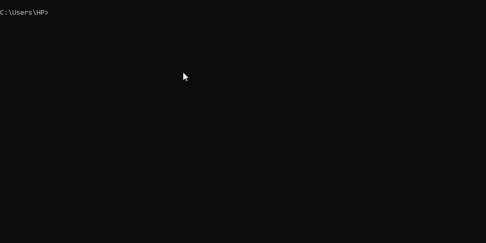

# next-prime

Toy CLI for finding the next prime number after the first argument passed to it.



## Commands

```bash
# PS: For the big macs, I use a windows computer

# This will clone to current directory
git clone https://github.com/Di-void/next-prime-cli.git .

# You can use your fave pkg manager here (node is required)
pnpm i

pnpm run build

# install globally
npm i -g .

next-prime
```
